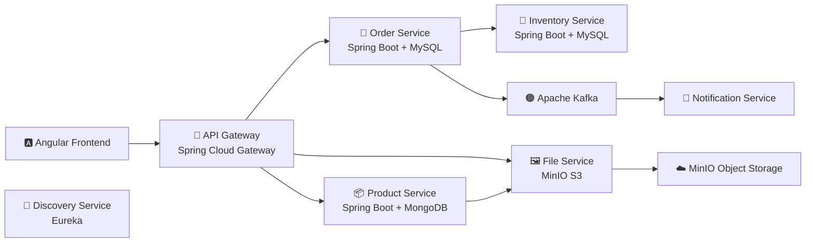
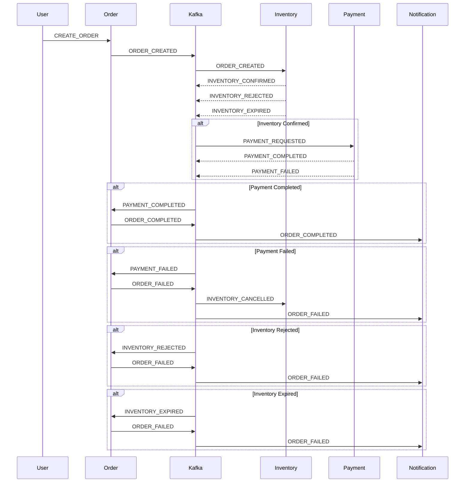
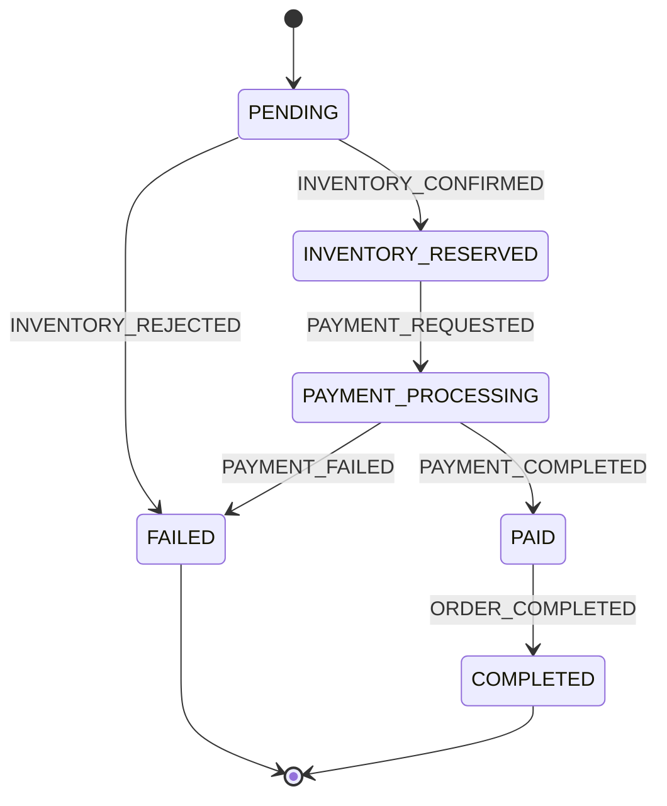

---
# 🧩 MicroserviceGrid (Saga version)
**MicroserviceGrid** is a full-fledged microservices system built on **Spring Boot 3 / Spring Cloud**,  
featuring a reactive entry point, asynchronous communication, fault-tolerance,  
monitoring, and centralized management via **Docker Compose**.

This repository serves as the infrastructure and development orchestration layer for the entire ecosystem and includes:
- **Docker Compose configurations** for all microservices
- **Observability stack** (Prometheus, Grafana, Loki, Tempo)
- **Keycloak** for authentication and authorization
- **Apache Kafka** for event-driven communication
- **Single network** shared by all services

---

## 🔁 Architecture Evolution

This project demonstrates the transition from monolithic-style service communication to event-driven distributed architecture.

### Legacy Version
✔ Synchronous REST communication  
✔ Tight coupling between services

Available here: 👉🔗[Old Version](https://github.com/Andrij72/MicroServiceGrid/tree/old-version_crud-architectur)

---

### Current Architecture (Event-Driven / Saga-Based)
✔ Event-driven communication  
✔ Saga pattern (choreography)  
✔ Kafka-based messaging  
✔ Fault-tolerant distributed processing

---

## 🏗 📦 System Architecture Overview



**Arrow explanations:**
* Order --> Inventory – synchronous REST call to check and reserve stock
* Order --> Kafka – publishes an event for Notification Service
* Product --> File – Product Service interacts with File Service to store and retrieve images

---

## 🧠 DDD Layer Structure
```
Client
↓
API Gateway
↓
Application Layer
↓
Domain Layer
↓
Infrastructure Layer
```
Each service owns its domain and data.

| Service       | Responsibility                   | Database    |
|---------------|---------------------------------|------------|
| **Order**     | Order lifecycle, status transitions | MySQL      |
| **Inventory** | Stock reservation & rollback      | MySQL      |
| **Payment**   | External bank integration         | PostgreSQL |
| **Notification** | User communication              | -          |
| **Product**   | Catalog management                | MongoDB    |
| **File**      | Image storage (S3 API via MinIO) | MinIO      |

No shared databases. No cross-service transactions.

---

## 🔄 Saga Flow (Choreography Pattern)


---

## 📦 Order State Machine



---

## 🔁 Saga Compensation Flow

The system guarantees eventual consistency using explicit compensation events.

### 🔴 Payment Failure Compensation
PAYMENT_FAILED
↓
ORDER_FAILED
↓
INVENTORY_CANCELLED
↓ Inventory releases reserved stock


Inventory Service executes domain rollback via:

```java
public void release(int quantity) {
    validateQuantity(quantity);
    if (quantity > reservedQuantity) {
        throw new InvalidReservationStateException(
                "Cannot release " + quantity + " from reserved " + reservedQuantity
        );
    }
    reservedQuantity -= quantity;
    availableQuantity += quantity;
}
```
🔴 Inventory Rejection Compensation
INVENTORY_REJECTED
↓
ORDER_FAILED
↓ Notification sent to user
---

## 🧠 Compensation Principles

1. [ ] No distributed transactions
2. [ ] No shared databases
3. [ ] No cross-service rollback calls
4. [ ] Only domain events trigger compensation
5. [ ] Each service owns its state and recovery logic

This ensures:
* Loose coupling
* Fault isolation
* Eventual consistency
* Production-grade distributed behavior
---

## 🔄 Event Flow Overview

**Order publishes:**
- `ORDER_CREATED`
- 
**Inventory listens:**
- `ORDER_CREATED`
- publishes `INVENTORY_CONFIRMED`
- publishes `INVENTORY_REJECTED`
- publishes `INVENTORY_EXPIRED`

**Payment listens:**
- `INVENTORY_CONFIRMED`
- publishes `PAYMENT_COMPLETED`
- publishes `PAYMENT_FAILED`

**Order listens:**
- `PAYMENT_COMPLETED`
- `PAYMENT_FAILED`

**Notification listens:**
- `ORDER_PAID`
- `ORDER_FAILED`
- `ORDER_COMPLETED`

---

## 💳 Payment Service (External Integration Simulation)

Payment Service integrates with:

- 🏦 **Bank Mock Service**

**Simulated behavior:**
- 70% → SUCCESS
- 20% → DECLINED
- 10% → INTERNAL ERROR

**Implements:**
- WebClient (Reactive)
- Retry strategy
- Timeout handling
- Idempotency protection

---

## ⚙️ Tech Stack

- Java 21 / Spring Boot 3
- Spring WebFlux / Reactive Gateway
- MongoDB / MySQL / PostgreSQL
- Apache Kafka
- Spring Cloud API Gateway
- Spring Cloud Netflix Eureka (Service Discovery)
- Spring Security + Keycloak (OAuth2 / JWT)
- Resilience4J (CircuitBreaker / RateLimiter / Bulkhead)
- Prometheus / Grafana / Loki / Tempo
- Docker / Docker Hub
- Kubernetes (planned)
- GitHub Actions (CI/CD)
- Testcontainers (Integration Tests)
- MapStruct (DTO Mapping)
- Liquibase / Flyway (DB Versioning)
- Angular 20 (Frontend + Admin Panel)
---

## 🧠 Services Overview

| Service                  | Description                                              | Status                 | Repository                                                             |
|--------------------------|----------------------------------------------------------|------------------------|------------------------------------------------------------------------|
| **Frontend (Angular)**   | Shop + Admin Panel                                       | 🚧 ~70% implemented   | [link](https://github.com/Andrij72/MicroserviceGridShopFrontEnd)       |
| **Product Service**      | Manages product catalog                                  | ✅ Implemented        | [link](https://github.com/Andrij72/product-service)                    |
| **Order Service**        | Handles customer orders                                  | ✅ Implemented          | [link](https://github.com/Andrij72/order-service)                      |
| **Inventory Service**    | Tracks product stock levels                              | 🚧 In progress         | [link](https://github.com/Andrij72/inventory-service)                  |
| **Notification Service** | Sends notifications (Email / Viber)                      | ✅ Implemented          | [link](https://github.com/Andrij72/notification-service)               |
| **File Service**         | Manages product images (upload/preview/download)         | ✅ Implemented          | [link](https://github.com/Andrij72/file-service)                   |
| **Discovery Service**    | Service registry (Eureka)                                | ✅ Implemented          | [link](https://github.com/Andrij72/discovery-service)                  |
| **API Gateway**          | Central reactive entry point (Spring WebFlux)            | ✅ Implemented          | [link](https://github.com/Andrij72/api-gateway)                        |
| **Auth Server**          | Authentication & Authorization (Keycloak / OAuth2)       | ✅ Implemented          | -                                                                 |
| **Payment Service**      | Payment and currency operations                          | 🕓 Planned             | -                                                                      |

---

## 📦 Storage & Data Strategy

| Service     | Database                  | Purpose                                     |
|------------|---------------------------|----------------------------------------------|
| 📦 Order    | MySQL                     | Order lifecycle, business state management  |
| 🏬 Inventory | MySQL                     | Stock tracking and reservation             |
| 💳 Payment  | PostgreSQL                | Transaction processing                      |
| 🛍 Product  | MongoDB                   | Product catalog and metadata                 |
| 🖼 Files    | MinIO (S3 Compatible)     | Image storage and delivery                   |

> The File Service uses **MinIO**, an S3-compatible object storage.  
> All image operations rely on the **AWS S3 API**, enabling seamless migration to AWS S3.

---

## 📊 Observability Stack

| Tool       | Purpose             |
|-----------|--------------------|
| Prometheus | Metrics             |
| Grafana    | Visualization       |
| Loki       | Logging             |
| Tempo      | Distributed tracing |

---

## 🧭 Service Discovery

- Eureka (dynamic registration, no hardcoded URLs)

---

## 🛍️ Frontend Application – MicroserviceGridShopFrontend

The frontend application of the Microservice Grid ecosystem is built with **Angular 20** and serves both the shop and admin panel.  
It communicates with the API Gateway and backend microservices to provide a modular, reactive, and scalable user interface.

📁 Repository: [MicroserviceGridShopFrontend](https://github.com/Andrij72/MicroserviceGridShopFrontEnd)

### Key Features

- Product catalog (Product Service)
- Inventory availability (Inventory Service)
- Order creation (Order Service)
- Admin panel for managing products, orders, and users
- Secure API integration via API Gateway
- Docker-ready production build

---

## 🚀 Running the Project

### 1️⃣ Start Microservices (Locally)
```bash
git clone https://github.com/Andrij72/MicroserviceGrid-DDD.git
cd MicroserviceGrid-DDD
docker-compose -f docker-compose.orchestrator_dev.yml up -d
```

### 2️⃣ Start Observability Stack
```bash
docker-compose -f docker-compose-observability.yml up -d
```
### 🔹 Observability Stack Services

### 🔹 Observability Stack Services

| Service    | Host Port   | Purpose                     |
|-----------|------------|-----------------------------|
| Loki      | 3100       | Logging                     |
| Prometheus| 9090       | Metrics                     |
| Tempo     | 3110 / 9411| Traces / Zipkin             |
| Grafana   | 3000       | Dashboards & Visualization  |

### 🔹 Network Configuration

```yaml
networks:
  microservices-net:
    external: true
```
* All services are connected to microservices-net
* Grafana depends on Loki, Prometheus, and Tempo via depends_on
* Anonymous access to Grafana is enabled (Admin role)
* Tempo stores data in ```./docker/tempo/tempo-data ```

---

## 🔐 Authentication & Authorization (Keycloak)

The system uses **Keycloak** as an OAuth2 / OpenID Connect server.

**Implemented**
* JWT-based authentication
* Client Credentials flow (service-to-service)
* Role-based access control (ADMIN / CLIENT)
* Integration via Spring Security

Keycloak Configuration

The basic Keycloak setup (realm, clients, roles) is documented with screenshots:
📁 [src/main/resources/static/keycloak/](src/main/resources/static/keycloak)

⚠️ **In a production environment**, Keycloak configuration should be done via **realm-export (JSON)** or **Terraform**.
Screenshots are provided for demonstration and educational purposes only.

---
## 🧪🧰 API Testing (Postman Collection)

### 📦 **Example Endpoints**

### Order Service

POST /api/v1/orders
PATCH /api/v1/orders/{orderNumber}/status
GET /api/v1/orders/{orderNumber}


### Inventory Service

POST /api/v1/inventory/reserve
POST /api/v1/inventory/release
GET /api/v1/inventory?skuCode=&quantity=


### Product Service

GET /api/v1/products/{sku}
POST /api/v1/admin/products


### File Service

POST /api/v1/files/upload/product/{sku}
GET /api/v1/files/preview?objectName=


A complete Postman collection is included for full API coverage.  
📁 File: `MicroServiceGrid.postman_collection_dev.json`

---

## 🚀🐳 Infrastructure & CI/CD and Deployment

- Docker images built and pushed to Docker Hub
- GitHub Actions automate building, testing, and publishing
- Docker Compose used for local development
- Kubernetes (planned) for orchestration and scalability

---

## 🔮 Roadmap (Practical)

- Inventory concurrency protection (locking / optimistic control)
- Saga compensation improvements
- Load testing
- Production Kubernetes deployment

### Future Enterprise Improvements

**Short Term**
- Inventory distributed locking
- Saga monitoring dashboard

**Mid Term**
- Kubernetes autoscaling
- Event streaming analytics

---

## 💡 Why This Architecture?

- REST between services caused tight coupling in the previous version
- Event-driven approach improved resilience
- Each service owns its data
- Saga ensures eventual consistency without distributed transactions

---

## 🧠 What This Project Demonstrates

This project demonstrates practical experience with:

• Distributed system design
• Event-driven architecture
• Domain-Driven Design (DDD)
• Saga pattern implementation
• Observability-first microservice infrastructure
• Secure service-to-service communication
• Production-style Docker orchestration

---

## 👤 Author

Andrii Kulynch

📅 **Version:** 3.0